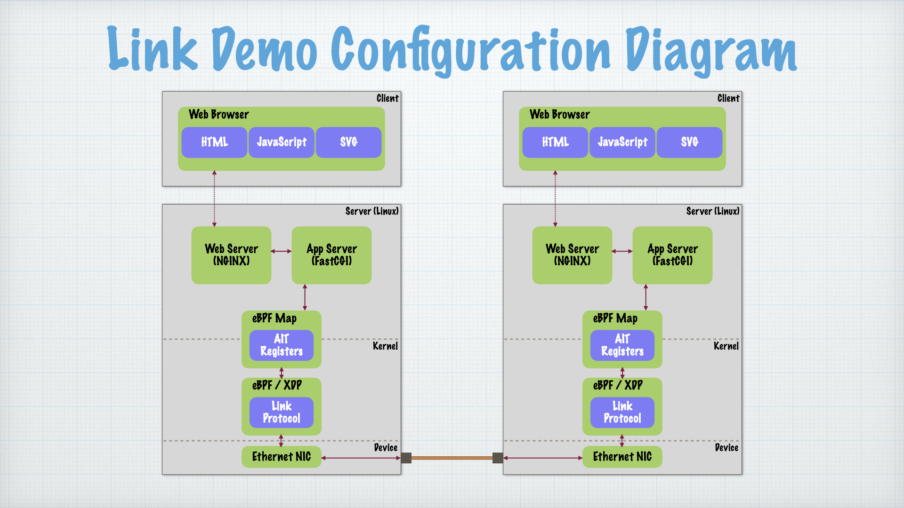

# Link Demo

The Link Demo illustrates the basic Liveness and AIT (atomic information transfer) link protocols.
It involves direct communication between two server/host machines.
AIT can be shown either via command-line tools,
or an interactive web page.

## Configuration

The configuration for a basic link demo involves several moving parts.



Major components include:
  * An Ethernet connection between machines
  * eBPF/XDP programs running in each kernel
  * A privileged App Server to access the eBPF Map interface
  * A Web Server to handle browser requests
  * A client Web Browser to run the interactive visualization(s)

## Setup

Assuming a power-cycle reboot of the machines in the demo configuration,
and the software components have already been built,
the following steps are required to prepare for the demo:

First, make sure that the eBPF/XDP hook is loaded with the AIT protocol driver.
```
$ cd ~/dev/eBPF/XDP
$ sudo ip -force link set dev eth0 xdp obj ait_kern.o
```

Second, start up the AIT application server to provide access to the eBPF Map.
```
$ cd ~/dev/eBPF/http
$ sudo cgi-fcgi -start -connect /run/ebpf_map.sock ./ebpf_fcgi
$ sudo chown www-data /run/ebpf_map.sock
```

Finally, open a browser window on the client machine
to display the Link Demo GUI at [`http://localhost/link_demo.html`](http://localhost/link_demo.html)
(replace `localhost` with the hostname or IP address of the server).
